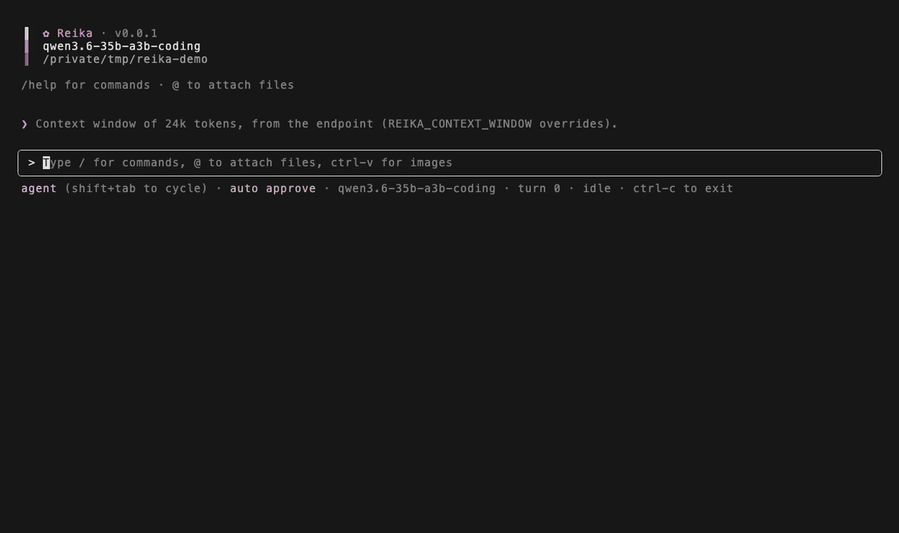

<p align="center">
  <picture>
    <source media="(prefers-color-scheme: dark)" srcset="docs/assets/reika-dark.svg">
    
  </picture>
</p>

<p align="center">
  A coding agent CLI for local and hosted models,<br>
  designed around small local models first.
</p>

<p align="center">
  <a href="https://reikacode.com">Website</a> ·
  <a href="#quick-start">Quick start</a> ·
  <a href="#documentation">Docs</a> ·
  <a href="docs/models.md">Tested models</a> ·
  <a href="README.zh-CN.md">简体中文</a>
</p>



<sup>A real local run of Qwen3.6 35B A3B (Unsloth UD-IQ2_M) via llama.cpp, sped up 3×. The model's first test fails and it fixes it from the error.</sup>

Reika is a coding agent CLI for local and hosted models. It was designed around small local models first (8B–35B, often at Q2–Q4, on a 16–32k context window), so it is careful with context, fails more gracefully, and says when it's stuck. It doesn't make a small model smarter. It makes working with one less frustrating: less of the window wasted, fewer loops on the same read, and less chance of the task quietly getting lost.

Day to day it runs on large hosted models, and small local ones are where it gets tested. At the small end, expect a better experience rather than frontier results. In testing, 14–35B models handled multi-file tasks most reliably, 8–9B models managed simple, well-scoped ones, and below 7B rarely got far.

Reika is pre-1.0, so commands, settings and behavior can still change between releases.

## What the measurements say

The harness's design choices were measured rather than assumed, and the record is published. It measures what a harness can and can't do about the problems small models run into, not how good the models become. The short version, with the runs and the numbers behind it in [docs/findings.md](docs/findings.md):

- **The harness's own context management cost more than the model did.** One mid-context rewrite re-processed 8,453 tokens of prompt — 7.9 minutes of prefill — where an append in the same session cost 25 tokens and 3.5 seconds.
- **Ask the model for its findings before a fold drops them.** In the A/B behind this, the arm whose findings were dropped folded five times, re-read files it had already read, and never answered; the arm that was asked answered from the digest.
- **A small model takes tool output literally.** A grep that said "0 matches" for a call it couldn't serve sent a model rewording a correct pattern for five rounds; a loop blamed on a 35B at Q2 was reika feeding the model its own tool-call markup back.
- **Prompt wording is the weakest lever.** On a vague task at Q2 a model converges or spirals about 50/50, and the harness cannot move that rate — only what the failing half costs.
- **The loop detectors separate cleanly.** Healthy reasoning rounds measure 0.2–0.3 on cross-round similarity; locked loops sit at 1.00, and a 38-round productive turn never fired the detector.

## Highlights

- **Context discipline.** Old tool output collapses to one-line summaries, requests stay append-only between shrink events so the engine's prompt cache survives, and when the window fills the model writes its own findings note before older turns fold into a recap.
- **Loop and spiral breaking.** Repeated reads, re-derived reasoning, and runaway thinking blocks are detected and answered with an escalating ladder (nudge, pinned ledger, tool withdrawal, honest stop) rather than a 30-minute spiral.
- **Checks on what the model does.** Blind edits are bounced to a read first, TypeScript edits are typechecked against a pre-edit baseline, and a written plan is tracked step by step from what the harness observes, not what the model claims.
- **Plan → implement.** A read-only plan mode that ends in a numbered, file-specific plan — refine it over as many turns as you like before executing — and a vibe mode that chains plan and implementation on every prompt.
- **Safe by default.** Ordinary edits run, dangerous commands still prompt, and on macOS model-chosen shell commands run under a kernel sandbox (writes confined to the project, network denied).
- **Extensible.** Stdio MCP servers add tools, and each tool also becomes a slash command. Markdown skills become slash commands too; `/issue` and `/review` ship with Reika and appear wherever `gh` and a GitHub remote are.
- **No telemetry.** Your code goes to the model server you configure and nowhere else: with a local server it never leaves your machine, and with a cloud API it goes to that provider. The only other requests are the web tools, when a web tool is used or you paste a link, a download of the public models.dev catalog to look up context limits (only for hosted endpoints, and never with your data), and whatever the MCP servers you configure do on their own.
- **Built for slow local engines.** Tolerates long prefills, handles tool-call dialects from models without a native template, and shows decode speed, context fill, and cache hit rate in the status bar.

## Requirements

- Node.js 22 or newer (macOS 11+ or glibc 2.28+ Linux — see [Platforms](docs/platforms.md)).
- An OpenAI-compatible model server: llama.cpp, MLX, vLLM, or a cloud API.
- macOS is the primary platform. Linux works, but without the shell sandbox or image-paste OCR (set `REIKA_VISION_MODEL` to read pasted images with a vision model instead). Windows may work under WSL2.
- A modern terminal (iTerm2, Ghostty, Kitty, etc). Recommended for proper TUI rendering.

## Quick start

Install it with any of these (npm and pnpm need Node ≥ 22; Homebrew pulls Node in):

```sh
npm i -g @alexwkleung/reika
pnpm add -g @alexwkleung/reika
brew install alexwkleung/tap/reika
```

Serve a model. Example below with llama.cpp:

```sh
llama-server -m <model.gguf> -c 24576 --jinja <other-launch-args>
```

Then point Reika at it:

```sh
export REIKA_MODEL=model  # or put it in ~/.config/reika/.env
cd your-project && reika
```

Using a hosted API instead? Skip the server and set `REIKA_BASE_URL`, `REIKA_API_KEY` and `REIKA_MODEL` to the provider's endpoint, your key and its model id; [Install and first run](docs/getting-started.md#hosted) has the details.

`REIKA_BASE_URL` defaults to `http://localhost:8080/v1`, llama-server's default. The context window is read from the server when it reports one, and for hosted endpoints from the models.dev catalog; set `REIKA_CONTEXT_WINDOW` when neither has it. Reika sends no sampling parameters of its own, so your server's flags are what apply.

To run from a checkout instead — `git clone https://github.com/alexwkleung/reika.git && cd reika`, then `pnpm install` (npm users: `npm i -g pnpm`) and `pnpm run install:global` to build and install the `reika` binary, or `cp .env.example .env` and `pnpm run dev` to run without installing. `pnpm run uninstall:global` removes the global binary.

## Common configuration

Set these in your shell, a project `.env`, or `~/.config/reika/.env` (in that order of precedence). The full list, experimental flags, and multi-model profiles are in [docs/configuration.md](docs/configuration.md).

| Key                    | Default                    | What                                                                                  |
| ---------------------- | -------------------------- | ------------------------------------------------------------------------------------- |
| `REIKA_MODEL`          | _required_                 | Model name, or a comma-separated list served by the same endpoint                     |
| `REIKA_BASE_URL`       | `http://localhost:8080/v1` | OpenAI-compatible endpoint                                                            |
| `REIKA_API_KEY`        | `no-key`                   | API key (any non-empty value for local servers)                                       |
| `REIKA_CONTEXT_WINDOW` | _probed from the server_   | Context window in tokens; drives compaction, the context gauge, and the repo map size |
| `REIKA_MIN_GEN_TOKENS` | _learned_ (from `2048`)    | Room reserved for the reply; learned from the model's rounds, set it to pin           |
| `REIKA_AUTO_APPROVE`   | `safe`                     | `off` confirms every edit and command; `bypass` confirms nothing                      |

## Modes

`Shift+Tab` cycles modes, or switch with a slash command. The mode and model you end a session in are the ones the next session opens in.

| Mode      | What it does                                                                 |
| --------- | ---------------------------------------------------------------------------- |
| `agent`   | The default: the model reads, edits, and runs commands                       |
| `plan`    | Read-only exploration that ends in a written plan; `/implement` runs it      |
| `vibe`    | Plans first, then implements the plan, on every prompt                       |
| `minimal` | Shell only, with no repo map or project context loaded upfront               |
| `grind`   | Agent turns run a fixed, careful procedure: define done, test, review        |
| `chat`    | Plain conversation with a separate history; web tools only                   |
| `shell`   | Your input runs as a shell command, and the output joins the agent's context |

`reika -p "<prompt>"` runs a single turn headless and prints the reply, for scripts and other harnesses. See [docs/usage.md](docs/usage.md) for modes in detail, headless flags, and every slash command.

## Safety

- **Approvals** default to `safe`: ordinary edits and commands run on their own, but anything matching a dangerous pattern (`rm -rf`, force pushes, package installs, `curl`, …) and any write outside the project still asks you first. `bypass` can only be set at launch, never mid-session.
- **Sandbox** (macOS, on by default): model-chosen shell commands can write only inside the project, temp, and cache directories, and have no network apart from loopback and read-only `git`/`gh`. A command you explicitly approve runs unsandboxed. `REIKA_SANDBOX=0` turns it off.

Found a way around one of these? Report it privately; see [SECURITY.md](SECURITY.md).

## Documentation

The same pages are on the website, [reikacode.com](https://reikacode.com).

| Doc                                              | Covers                                                                                    |
| ------------------------------------------------ | ----------------------------------------------------------------------------------------- |
| [Install and first run](docs/getting-started.md) | Requirements, installing, serving a model, and the first run                              |
| [Configuration](docs/configuration.md)           | Every `.env` key, experimental flags, named profiles, last-session state                  |
| [Modes, headless, commands](docs/usage.md)       | Each mode in depth, `reika -p`, slash commands, `/save` transcripts                       |
| [Tools](docs/tools.md)                           | The model's tools, approval prompts, web search setup, MCP servers, `.gitignore`          |
| [Instructions and skills](docs/skills.md)        | `AGENTS.md`, skills as slash commands, plain-English routing, pasted URLs                 |
| [Tested models](docs/models.md)                  | Local quants and APIs Reika has been run against                                          |
| [Findings](docs/findings.md)                     | The measured record: what broke, what held, and how each number was obtained              |
| [Platforms](docs/platforms.md)                   | Requirements, running on a weak machine, what differs on Linux and Windows                |
| [Architecture and caveats](docs/architecture.md) | How the harness works, and known limitations                                              |
| [Contributing](CONTRIBUTING.md)                  | Scripts, design philosophy, a pointer to `AGENTS.md`, and external contributor guidelines |
| [Changelog](CHANGELOG.md)                        | What changed in each release                                                              |

## Inspired by

Claude Code, Codex, Crush, OpenCode, Pi, Aider, DeepSeek Harness, Qwen Code, Kimi Code CLI, Gemini CLI, Junie, and DS4.

## License

Apache License 2.0. See [LICENSE](LICENSE) and [NOTICE](NOTICE).

## Supporting our work

If Reika is useful to you, consider supporting it via [GitHub Sponsors](https://github.com/sponsors/alexwkleung), [Ko-fi](https://ko-fi.com/alexwkleung), or [Buy Me a Coffee](https://buymeacoffee.com/alexwkleung). See [Support](docs/support.md) for what it funds and other ways to help.
